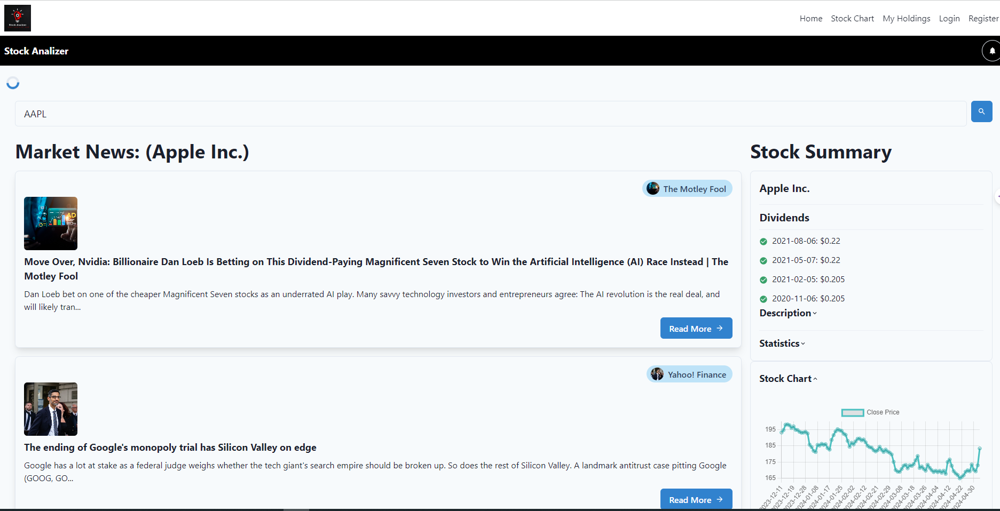

# Stock Analyzer

**Stock Analyzer** is an advanced, user-friendly application designed to provide real-time data and analytics for investors in the stock market. This tool helps you visualize data trends, manage your investment portfolio, and make informed trading decisions.



---

## Features

- **Real-Time Data**: Fetch live stock prices and market trends.
- **Portfolio Management**: Track your investments and analyze portfolio performance.
- **Data Visualization**: Interactive charts and graphs to visualize stock performance over time.
- **Alerts & Notifications**: Customizable alerts for price changes, news, and other investment triggers.
- **User Account Management**: Secure login and authentication system for managing personal user profiles.

## Technologies Used

- **React**: For building a dynamic and fast frontend.
- **Node.js & Express**: Backend server technology.
- **MongoDB**: NoSQL database for storing user and stock data.
- **Chakra UI**: For designing a modern and responsive UI.
- **Chart.js**: For data visualization.

## Getting Started

These instructions will get you a copy of the project up and running on your local machine for development and testing purposes.

### Prerequisites

What things you need to install the software and how to install them:

```bash
node.js
npm
git
```

### Installing

A step-by-step series of examples that tell you how to get a development environment running:

1. Clone the repository:
   ```bash
   git clone https://github.com/icpmtech/stock-analyzer.git
   ```
2. Navigate to the project directory:
   ```bash
   cd stock-analyzer
   ```
3. Install dependencies:
   ```bash
   npm install
   ```
4. Start the development server:
   ```bash
   npm start
   ```

## Usage

Provide examples of how to use your project for various use cases.

```javascript
import { getStockData } from './api';

getStockData('AAPL').then(data => {
    console.log(data);
});
```

## Contributing

Contributions are what make the open-source community such an amazing place to learn, inspire, and create. Any contributions you make are **greatly appreciated**.

1. Fork the Project
2. Create your Feature Branch (`git checkout -b feature/AmazingFeature`)
3. Commit your Changes (`git commit -m 'Add some AmazingFeature'`)
4. Push to the Branch (`git push origin feature/AmazingFeature`)
5. Open a Pull Request

## License

Distributed under the MIT License. See `LICENSE` for more information.

## Contact

Your Name - [@CantinhodeNet](https://twitter.com/CantinhodeNet) - academy@cantinhode.net

Project Link: [https://github.com/icpmtech/stock-analyzer](https://github.com/icpmtech/stock-analyzer)

## Acknowledgments
